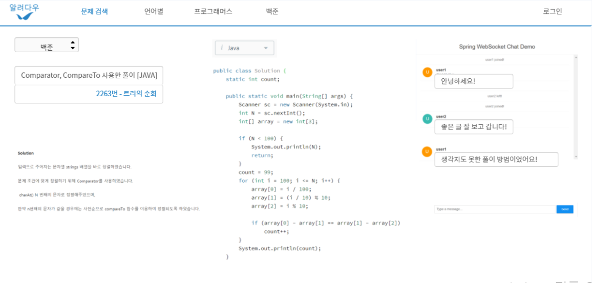
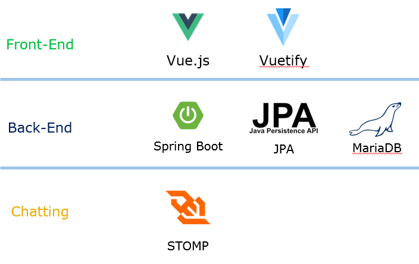
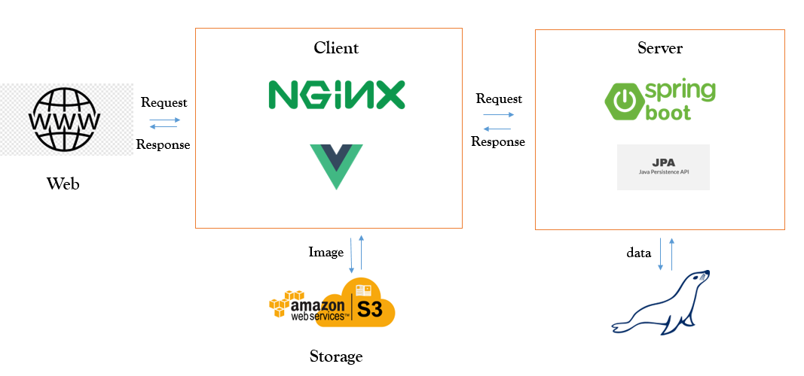

# 
<tab>알려다우

 

## 
기술스택

 

## 
API 명세서

### User

- 📘**POST** : /users(nickname, password) - 회원 가입

- 📘**POST** : /users/login(nickname, password) - 로그인

- 📗**GET** : /users/logout(nickname) - 로그아웃

- 📘**PUT** : /users(nickname, password, newPassword) - 비밀번호 변경

- 📕**DELETE**: /users/{id} (nickname, password) - 회원 삭제

- 📗**GET** : /users/nickname() - 닉네임 중복 검사

- 📘**PUT** : /users/nickname (nickname) - 닉네임 변경

  

### Post

- 📘**POST** : /posts(user_id, problemLink, problemType, problemTitle,

  ​															language, title, content, code) - 게시글 생성

- 📘**PUT** : /posts/{postId, language, source_link, title, content, code} - 게시글 수정

- 📕**DELETE** : /posts/{postId} - 게시글 삭제

- 📗**GET** : /posts() - 전체 게시글 조회
- 📗**GET** : /posts/{language}() - 언어별 풀이 조회
- 📗**GET** : /posts/{sourceType} - 플랫폼별 풀이 조회
- 📗**GET** : /posts/{userId} - 유저별 풀이 조회

- 📗**GET** : /posts/{sourceType}/{keyword} - 플랫폼별 풀이 검색

- 📗**GET** : /posts/{language}/{keyword} - 언어별 풀이 검색

- 📗**GET** : /posts/{sourceType}/{keyword} - 플랫폼+언어별 풀이 검색

- 📗**GET** : /posts/{keyword} - 게시글 통합검색 (언어, 타이틀, 컨텐츠)

  

### Chat

- 📗**GET** : /chat/{postId} - 채팅방 입장

- 📘**POST** : /chat/{postId} (userId, message) - 메시지 보내기

 

## ERD

 

## 시스템 아키텍처

 

## 팀 구성

| 이름   | 업무  |
| ------ | ----- |
| 이정건 | 90811 |
| 배민영 | 90813 |
| 황영준 | 90817 |

 

## 업무 분담

| 이름   | 역할        |
| ------ | ----------- |
| 이정건 | 게시글 기능 |
| 배민영 | 채팅 기능   |
| 황영준 | 회원 기능   |

