<center><center>


# <center><tab>알려다우</center>

<br/>

<hr/>

## 🚀 기술스택

<center><center>
​    <br/>

<center>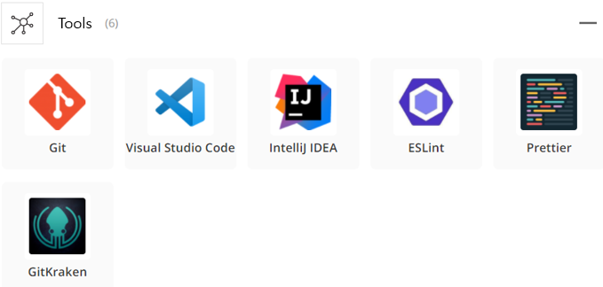<center>
    <br/>

<br/>

<hr/>

<center>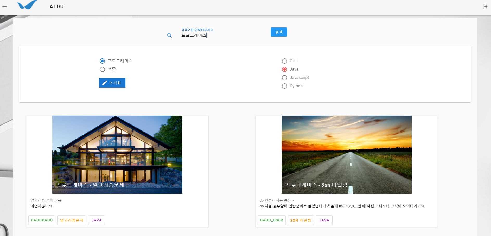<center>

<br/>

<center>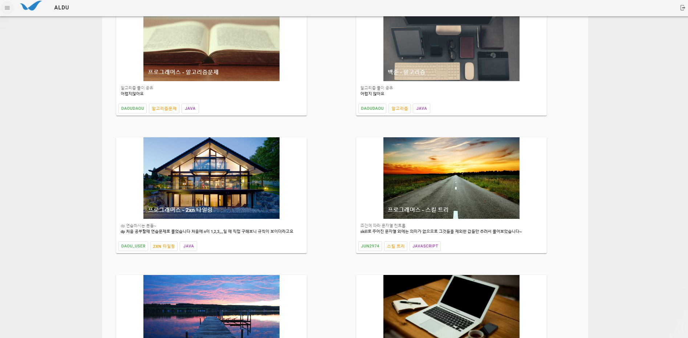<center>
<br/>

<center>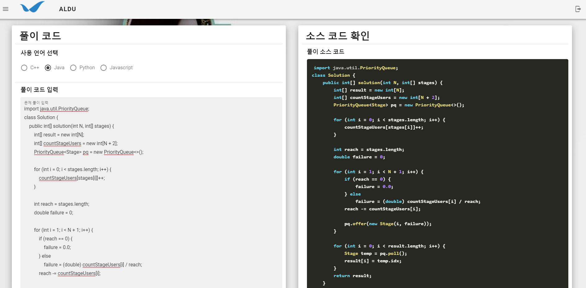<center>
<br/>

<center>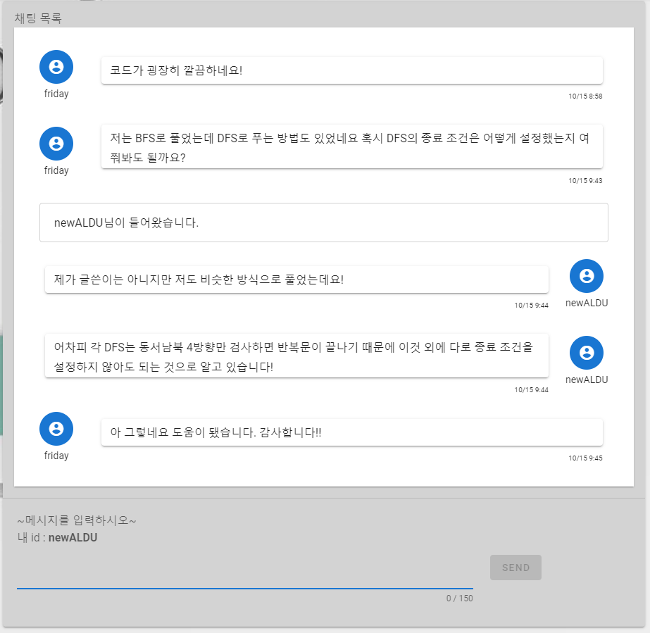<center>


<hr/>

## 💭 기획의도


<center>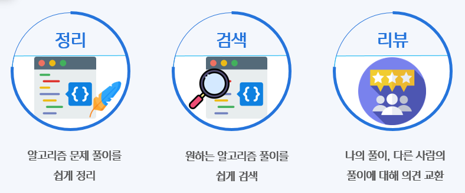<center>

<br/>

<hr/>

## 🚩 서비스 흐름도


<center>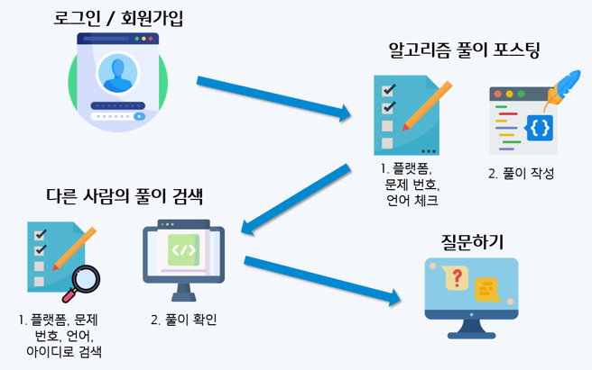<center>

<br/>

<hr/>

## 📑 API 명세서


<center>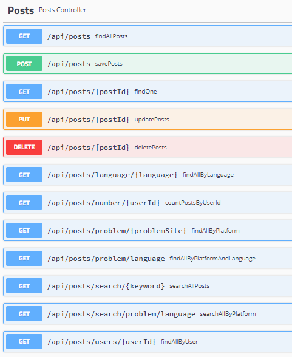<center>
    <center>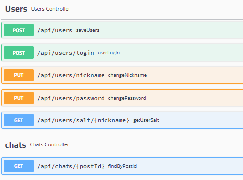<center>

<br/>

<hr/>

## 🎯 비즈니스 로직 테스트

<center>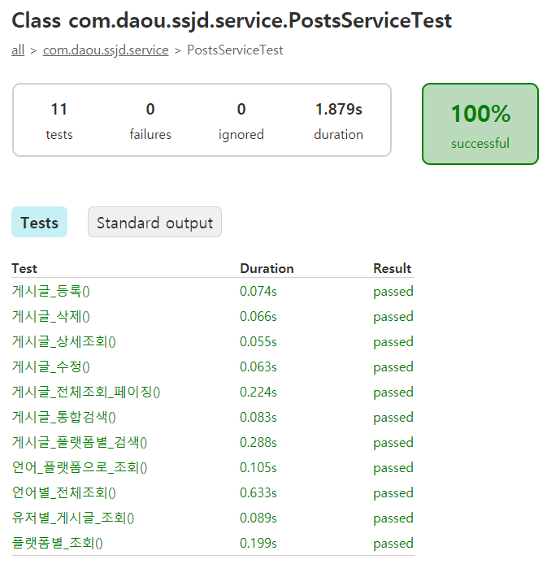<center>

<br/>

<hr/>

## 👨‍🔧 ERD

<center>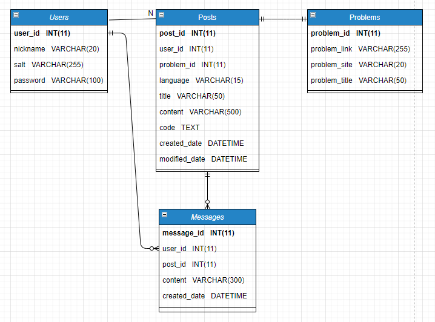<center>

<br/>

<hr/>

## 👩‍🔧 시스템 아키텍처

<center><center>

<br/>

<hr/>

## 🏃 Quick Start

### **Front-end (Vue.js)**

​	1️⃣ **npm install** 명령어를 실행시켜 주세요.

​	2️⃣ **npm run serve** 명령어를 실행시켜 주세요.

​	3️⃣  **index.js** baseUrl을 http://localhost:8080/ 으로 설정해주세요.

<br/>

### **Back-end (Spring boot)**

♻️ https://projectlombok.org/download **lombok**을 다운로드 후, dependency를 추가해주세요.

```
    <dependency>
        <groupId>org.projectlombok</groupId>
        <artifactId>lombok</artifactId>
        <scope>provided</scope>
    </dependency>
```

<br/>

✅ **com.daou.ssjd** 경로에 있는 **SsjdApplication**을 실행시켜주세요.

<br/>

<hr/>

## 👪 팀 구성


<center><center>

